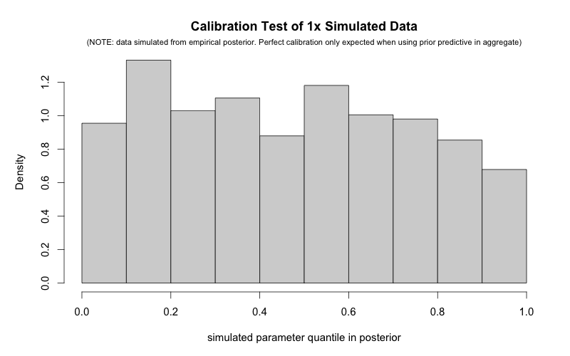
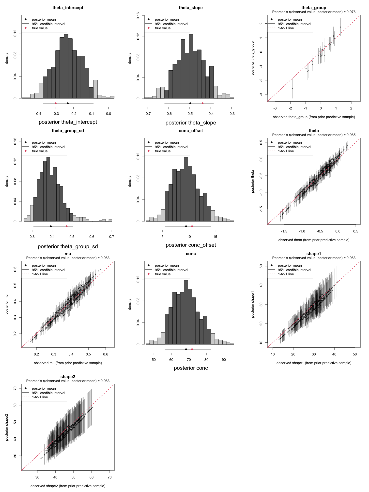
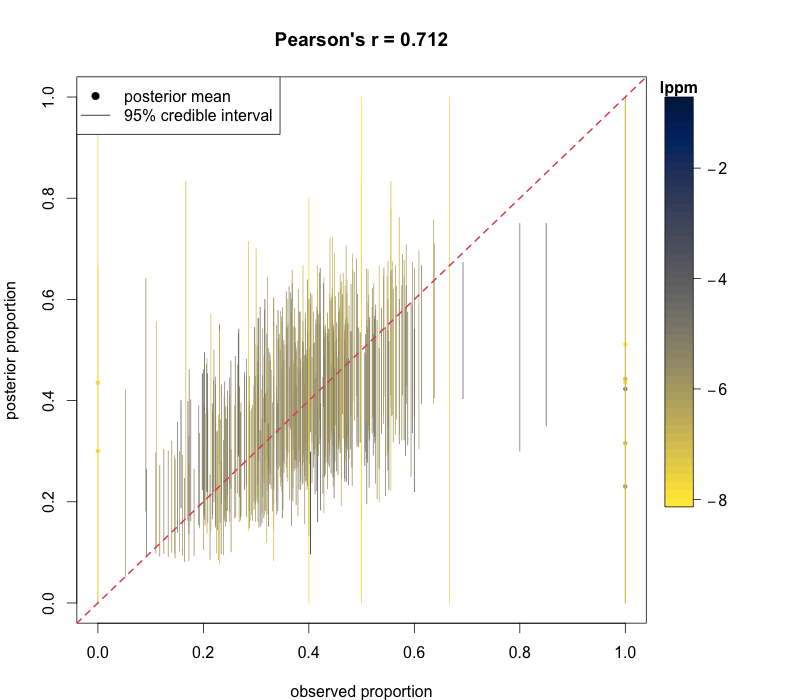

# Stan2R

Stan2R is a set of utilities I wrote to help convert [Stan](https://mc-stan.org/) models to R code. I did this for a few reasons -- sometimes I wanted to more easily perform prior or posterior predictive simulation or to estimate observation-wise posterior probabilities, or I wanted to interactively step through the execution of a complicated model to figure out where something was going wrong. Occasionally I'd want to return to a fitted model and generate quantities for it, and did not want to use [generate_quantities](https://mc-stan.org/docs/cmdstan-guide/generate_quantities_config.html) in CmdStan (where one could much of the same functionality). 

I've also used some of the underlying functions to piece together other utilities, like `flatten_model()`, which takes a conventional multilevel model and converts it to a single-level model according to supplied arguments, either for when we're optimistic and want to troubleshoot pathological posteriors (eg to fix topologically troublesome hyperparameters and determine if they're driving our faulty fits) or for when we're pessimistic and just want to Empirical Bayes things.

Also, collaborators are often unfamiliar with Stan, but are familiar with R. To help them understand a Stan model, I can trivially convert it to interactive R code for ease of exploration and intuition-building.

NOTE: do make sure to inspect any outputted R code for errors. I mostly wrote it with my own style preferences in mind, which may not match your own. I also did not exhaustively implement conversions for all Stan functions or distributions, or even for all features of Stan code (eg custom functions). Depending on the inputted model, you may have to modify converted scripts.

## Example

I wrote a short example (`\R\example.R`) using a small, multilevel beta-binomial model.

In it, I perform:

- **Model Conversion**: Converts Stan model (`\models\beta_binomial.stan`) into executable R code.
- **Prior Predictive Simulation**: Generates samples from the model's prior predictive distribution, saving them to `\data\beta-binomial_simulated-data.json` and `\output\beta-binomial_simulated-params.json`.
- **Model Fitting**: Fits the model to a sample from this prior predictive distribution using CmdStanR.
- **Posterior Predictive Simulation**: Uses the fitted MCMC samples to simulate from the posterior predictive distribution.
- **Posterior Predictive Mass Estimation**: Uses the fitted MCMC samples to compute average fit mass for each observation.
- **Visual Assessment of Calibration**: Visually inspects model calibration by generating histograms of parameter quantiles in each of their marginal joint posterior distributions.
- **Visual Assessment of Model Fit**: Compares posterior predictive means against both "observed" and "unobserved" variables (all of whose true values are known, as they were sampled from the model prior). Visualizes these with scatterplots, alongside estimates of mean log posterior predictive masses and credible intervals.

This outputs a few quick figures, like



(showing quantiles for outcomes -- deviation from uniform(0,1) representing poor calibration)



(showing posterior means and credible intervals for different model parameters, plotted against their true values)



(showing posterior predictive means for observed proportions, plotted against their true values and colored by LPPM)


## Getting Started

## Prerequisites

Before you begin, ensure you have R (version 4.0.0 or later) and CmdStan installed on your system. CmdStanR requires an installation of CmdStan to interface with Stan's C++ backend. Follow the instructions on the [CmdStanR GitHub page](https://mc-stan.org/cmdstanr/articles/cmdstanr.html) for CmdStan installation guidelines.

## Installation

### 1. Install Required R Packages

Stan2R utilizes a set of R packages for data manipulation, Bayesian inference, and visualization. Install the required packages by running the following commands in your R environment:

```R
# Install CRAN packages
install.packages(c("data.table", "dplyr", "cmdstanr", "posterior", "extraDistr", "jsonlite", "parallel", "viridisLite"))

# Optionally, ensure cmdstanr is configured with CmdStan
cmdstanr::install_cmdstan()
```

### 2. Clone the Repository

After setting up the R environment and CmdStan, clone the Stan2R repository to your local machine:

```bash
git clone https://github.com/NikVetr/Stan2R.git
```

## Usage

Please see `R/example.R` for example usage -- you're probably best served by modifying that script for your own use. If things don't work, feel free to reach out and I'll do my best to help.

## Contributing

Contributions or extensions to this program are welcome! If you have suggestions for improvements or new features, please feel free to fork the repository and submit a pull request.
